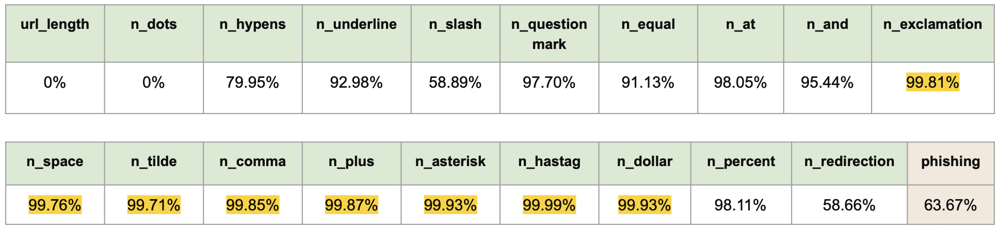
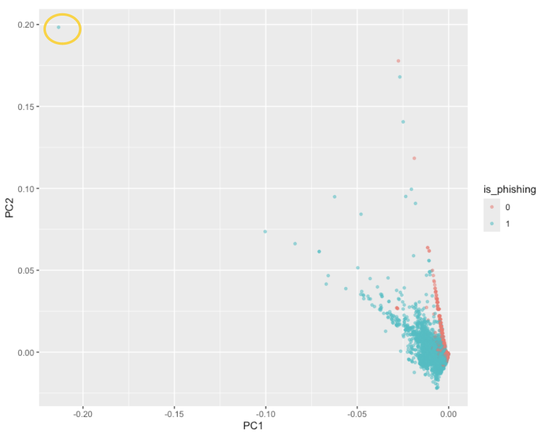
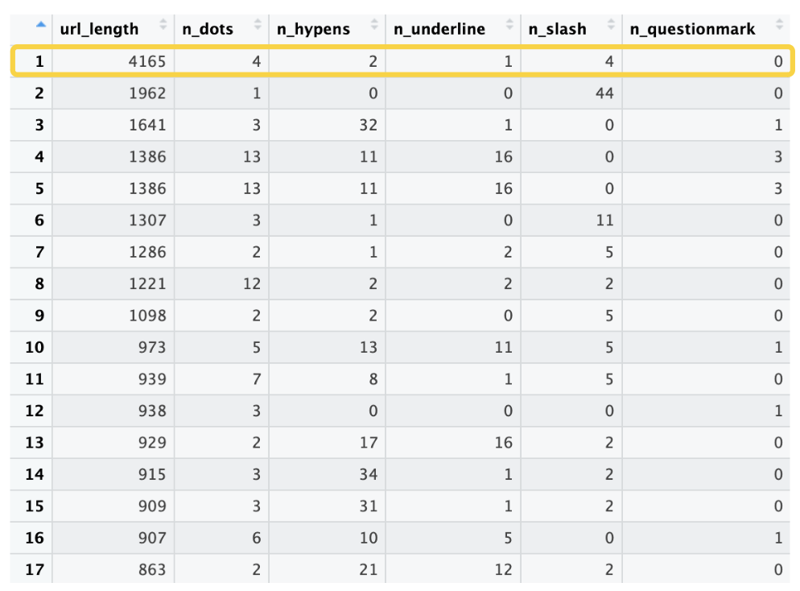
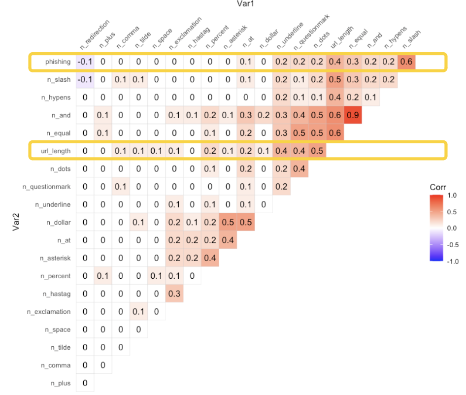
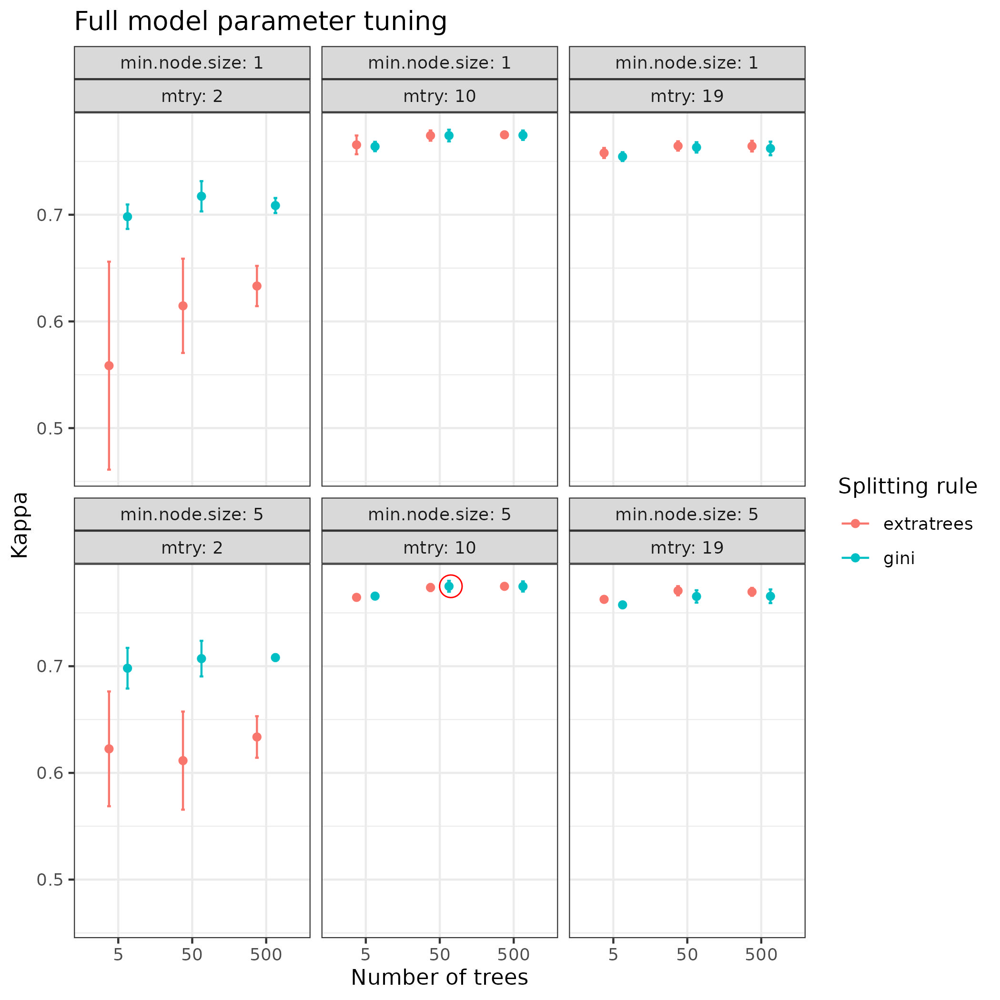

# Introduction

In the digital age, phishing is a common practice in which cybercriminals attempt to steal sensitive, personal information from users, such as their usernames/passwords, social-security number, credit card information, etc. Phishing can occur in many different forms, but one common way is through websites. You have probably received suspicious emails before from unknown senders. These emails usually contain phrases to bait your interest and may contain a link to a website that sounds interesting, but really is just collecting your personal information. We want to avoid clicking on phishing links, while also not missing out on important non-phishing links that we need to access. 

## Motivation

The goal of this project is to be able to predict whether or not a website link is a phishing website or not, based on only features of the URL. If we ever receive an email with a link from an unknown sender, but we aren't sure if it is suspicious, we hope that this data analysis can: 
1. Predict whether the URL is phishing or not, and
2. Provide insight into what features of the URL are most important to look out for when judging whether the link is phishing or not.


## Data

In order to achieve these goals, we work with a data set from Kaggle (linked [here](https://www.kaggle.com/datasets/danielfernandon/web-page-phishing-dataset)) which contains 100,007 website URLs, 19 features of these URLs, and an indicator (0 or 1) of whether the URL is a phishing website or not. The 19 features are count characteristics of each URL, including: 

* url length
* number of dots in the URL
* number of hyphens in the URL
* number of underlines in the URL
* number of "+" characters in the URL
* number of redirections (number of times the URL redirects you to another website)

Below we conduct exploratory data analysis to examine the univariate and bivariate distributions of the features and response variable (indicator of phishing).

## Exploratory Data Analysis

```{r, message=FALSE, warning=FALSE}
library(knitr)
library(kableExtra)
library(data.table)
library(tidyverse)
library(dplyr)
```


### Data Cleanliness

There are no missing values in the original data set. The data is clean and complete as sourced and required no pre-processing. Additionally, since nearly the features are all counts (with extreme sparsity), no standardization of the covariates was performed before data splitting or modeling.

### Sparsity

Because most of the features in this data are count variables, we are curious about how much sparsity (zero counts) are in the data. In Figure 1 below, we see the percentage of each column that has zero values. There is extreme sparsity in many of the covariates and there are eight covariates highlighted in yellow for which there is over 99% sparsity, or over 99% of zero values. Although we have 100,000 rows of observations, this sparsity heavily restricts the amount of actual data we have to work with for future model fitting. Due to this sparsity, it was unnecessary to further look at individual histograms or distributions of each variable, as they would be very skewed and unreadable. In addition, this sparsity was so extreme that log-transformations or standardization of covariates would not be helpful or sensible for model fitting. The lack of data mentioned earlier is the reason why we choose to model the response against all covariates whenever possible, before considering variable importance. 

```{r, echo=FALSE, fig.cap="Figure 1.", fig.align="center"}

```

We also see that the response variable `phishing` does not have extreme sparsity. In fact, the roughly 70/30 split of class labels does not even warrant adjusting for class imbalance in the model. 

### PCA, Outliers, and Correlation

We conduct PCA on all the features to get an introductory feel for the most important dimensions of the data. We plot PC1 vs. PC2 in Figure 2 below and color each point based on the true response labels indicating phishing or not. We see that there is some good separation between the classes in the bottom right section of the plot, which shows there is definitely a potential decision boundary that we can find with our future models. 

```{r, echo=FALSE, fig.cap="Figure 2.", fig.align="center"}

```

There is also a notable outlier circled at the top left of the plot in Figure 2. When we sort the data by decreasing URL length in Figure 3, we notice that there is an extreme value of URL length (4165) that is much larger than every other URL length. Perhaps this observation is the outlier in the PCA plot. However, it is definitely possible that a large URL length implies large counts of other character covariates, by nature, so it is possible that another column is actually motivating the outlier. 


```{r, echo=FALSE, fig.cap="Figure 3.", fig.align="center"}

```

We investigate this natural correlation between columns in this data by constructing a correlation plot, given in Figure 4 below. Here, we see that URL length is actually not strongly correlated with any other variables in the data, contrary to our previous expectation, so that outlier in the PCA plot is likely the extreme URL length observation. Other than one strong positive correlation of 0.9 between number of &s and number of =s, there is no other strong evidence of collinearity between covariates. Also, there are no strong correlations between the response `phishing` and any covariates; there is a correlation of 0.6 with number of /s, but otherwise nothing too notable or impactful for future model fitting.

```{r, echo=FALSE, fig.cap="Figure 4.", fig.align="center"}

```


## Data Splitting and Setup

We split our full data set without any pre-processing into a training set with 80\% of data and test set with 20\% of data. Note that the test set was only used to compare the performance of all tuned models at the end. 

# Packaging


All code and data for this project can be found in our R package `phishing735`. This package contains the following functions. Please refer to associated `roxygen` documentation for more details about each function.

* `phishing_data_checks`
    * Inputs: none
    * Outputs: printed messages about intro data checks
* `phishing_corrs_plot`
    * Inputs: none
    * Outputs: ggplot object 
* `split_phishing_data`
    * Inputs: none
    * Outputs: csv files of split data written to derived_data directory
* `get_data`
    * Inputs: `name`: a string from {"train_x", "train_y", "test_x", "test_y"}
    * Outputs: A dataframe for train or test x, a factor of level 0 or 1 for train or test y
* `confusion_mat`
    * Inputs: `pred`, `true`, `title`, `file.out`
    * Outputs: ggplot object
* `phishing_pca`
    * Inputs: none
    * Outputs: ggplot object
* `run_rf`
    * Inputs: `k`, `cv`, `mtry`, `min.node.size`, `n_tree`, `seed`, `trimmed_var`, `verbose`, `file`
    * Outputs: train object from caret for the optimal model
* `SGD_logistic`
    * Inputs: `y`, `X`, `batch_size`, `learning_rate`, `epsilon`, `max_iter`
    * Outputs: List of coefficients and number of iterations
* `run_svm`
    * Inputs: **FILL IN** **************************
    * Outputs: **FILL IN** **************************
    
    

    


# Methods
## Likelihood Approach
### Generalized Linear Model

Suppose our training set has $n$ datapoints. Then: 

\noindent Let $Y$ be the $n \times 1$ response vector:
$$ Y_i = 
\begin{cases} 
1 & \text{if webpage is phishing} \\
0 & \text{if not} 
\end{cases} \quad i = 1, \ldots, n$$. 

\noindent Let $X^T$ be the $n \times (p + 1)$ design matrix: 
\[ X^T = 
\begin{bmatrix}
1 & x_{11} & \cdots & x_{1p} \\
1 & x_{21} & \cdots & x_{2p} \\
\vdots & \ddots & \vdots \\
1 & x_{n1} & \cdots & x_{np} \\
\end{bmatrix}
\]

\noindent  Let $p_i = P(Y_i=1|\mathbf{x_i^T)}$. Since our response variable is binary, we fit a logistic  model on the dataset. We use the logit link. 

$$logit(p_i) = log(\frac{p_i}{1-p_i}) =  \beta_0 + \beta_1x_{i1} + \dots + \beta_px_{ip} = \mathbf{x_i^T} \beta$$

\noindent Since this is binary data, the individual data come from a Bernoulli distribution. Our joint likelihood function is: 

$$L(\beta|Y, n) = \prod_{i=1}^n p_i^{I(y_i=1)} (1-p_i)^{I(y_i=0)}$$

\noindent The log-likelihood is:

\begin{align}
l(\beta|Y, n) &= \sum_{i=1}^n I(y_i=1) log(p_i) + I(y_i=0) log(1-p_i) \\
&= \sum_{i=1}^n y_i log(p_i) + (1-y_i) log(1-p_i)
\end{align}

### Logistic Regression with Mini-Batch SGD

We chose to use mini-batch stochastic gradient descent to find the solution for \( \beta \). This decision was based on the principle that maximizing the log-likelihood function is analogous to minimizing its negative counterpart. Therefore, we define our cost function as \( J(\beta) = -l(\beta \mid Y, n) \). The algorithm proceeds as follows:

1. Initialize the estimate for $\beta$.
2. At each iteration, select a mini-batch of size $\alpha$ from $X^T$, denoted $\{\mathbf{x_i^T}\}$, where $i$ indexes the randomly selected rows.
3. Calculate the gradient of the negative log-likelihood, $\nabla J(\beta)$, using the mini-batch sample.
4. Update $\beta$ according to the rule: $\beta_{\text{new}} = \beta_{\text{old}} - \eta \nabla J(\beta)$, where $\eta$ is the learning rate.
5. Repeat steps 2-4 until convergence, defined as $|\beta_{\text{new}} - \beta_{\text{old}}| < \epsilon$, where $\epsilon$ is a pre-specified threshold.


\noindent The gradient of the log-likelihood for our model is detailed below (for full derivation, please see the $\textbf{Appendix B}$):

$$\nabla J(\beta)^T = [ \frac{\partial J(\beta)}{\partial \beta_0} \ldots \frac{\partial J(\beta)}{\partial \beta_p} ] = \mathbf{X^T}(\mathbf{p}-\mathbf{y})$$

\begin{align}
\frac{\partial J(\beta)}{\partial \beta_j} &= \frac{\partial J(\beta)}{\partial p_i} \cdot \frac{\partial p_i}{\partial \beta_j} \\
&= \sum_{i=1}^n - \left(\frac{y_i}{p_i} + \frac{1-y_i}{1-p_i}\right) \cdot p_i(1-p_i) x_{ij} \\
&= \sum_{i=1}^n (-y_i(1-p_i) + (1-y_i)p_i) x_{ij} \\
&= \sum_{i=1}^n (p_i - y_i) x_{ij} 
\end{align}


\noindent We initialized \(\beta\) as the zero vector at the start of the algorithm and continued iterations until convergence. Convergence was defined by the condition \( \left| \beta_{\text{new}} - \beta_{\text{old}} \right| < \epsilon \), where \(\epsilon = 10^{-4}\).

\noindent First, we verified that our SGD algorithm functioned correctly through simulation. We generated 100,000 observations with 20 covariates, each drawn from a normal distribution:

$$X_i \sim \mathcal{N}(0, 1) \text{ for } i = 1, \ldots, 20$$

Given that our dataset contains only non-negative covariate values, we transformed all covariates by taking their absolute value:

$$X_{i, \text{new}} = \left| X_i \right|$$

We then assigned the coefficients a value of 0.5 or -0.5, and the outcomes were calculated using a logistic regression model with a logit link function:

$$\text{logit}(p_i) = \log\left(\frac{p_i}{1-p_i}\right) = \beta_0 + \beta_1 x_{i1} + \cdots + \beta_p x_{ip} = \mathbf{x_i}^T \beta$$

where $\beta_0 = -0.5$, $\beta_j = 0.5$ for $j = 1, \ldots, 10$, and $\beta_j = -0.5$ for $j = 11, \ldots, 20$.

The mini-batch size ($\alpha$) was set to 128, and the learning rate ($\eta$) was set to 0.001. The algorithm converged after 962 iterations, and we calculated the mean square error (MSE) as the squared differences between the parameter estimates derived from our algorithm and those generated by the General Linear Model (GLM) function from the \textbf{stats} package in R. The MSE is $8 \times 10^{-6}$, indicating that our algorithm performs comparably to the GLM.

```{r, eval=FALSE}
# Conduct simulation
set.seed(123)
n=1e5
X.sim = abs(matrix(rnorm(n * 20), nrow = n, ncol = 20))
data.sim = as.data.frame(X.sim)
names(data.sim) = paste("X", 1:20, sep="")
beta.sim = c(-0.5,rep(0.5,10),rep(-0.5,10))
X.intercept.sim = cbind(1,X.sim)
prob = exp(X.intercept.sim %*% beta.sim) / (1+ exp(X.intercept.sim %*% beta.sim))
data.sim$y.sim = rbinom(n,1,prob)
mean(data.sim$y.sim)
fit.sim = glm(data = data.sim, y.sim ~.,family = "binomial")
coef(fit.sim)
lg.sim = LogisticRegression(data.sim$y.sim, X.sim, epsilon = 1e-4, batch_size = 128, learning_rate=1e-3, max_iter = 50000)
cat("MSE with true beta: ",mean((lg.sim$coefficients - beta.sim)^2))
cat("MSE with GLM estimates: ",mean((lg.sim$coefficients - coef(fit.sim))^2))
```

\noindent Next, we applied the SGD algorithm to the phishing dataset, carefully tuning the mini-batch size ($\eta$) and learning rate ($\alpha$) to optimize performance. We removed the covariates that had more than 99\% missing data: $\textit{n_exclamation}, \textit{n_space}, \textit{n_tilde}, \textit{n_comma}, \textit{n_plus}, \textit{n_asterisk}, \textit{n_hashtag}, \textit{n_dollar}$. These variables were so sparse that we believed including them in the model would not be beneficial. We selected the optimal hyperparameters ($\alpha, \eta$) by evaluating the convergence speed, accuracy and F1 score. Overall, we chose a mini-batch size ($\alpha$) of 64 and a learning rate ($\eta$) of 0.001 for our final model. 

```{r, eval=FALSE}
### tune parameters, no need to run when compiling report because of time-consuming ###

# read training and testing set
y.train = fread("derived_data/train_y.csv") %>% unlist() %>% as.vector()
X.train = fread("derived_data/train_x.csv") %>% select(-n_exclamation, -n_space, -n_tilde, -n_comma, -n_plus, -n_asterisk, -n_hastag, -n_dollar) %>% as.matrix()
y.test = fread("derived_data/test_y.csv") %>% unlist() %>% as.vector()
X.test = fread("derived_data/test_x.csv") %>% select(-n_exclamation, -n_space, -n_tilde, -n_comma, -n_plus, -n_asterisk, -n_hastag, -n_dollar) %>% as.matrix()

tune = as.data.frame(matrix(c(rep(NA,12*5)),ncol=5))
colnames(tune) = c("batch_size","learning_rate","iteration","Accuracy","F1_score")


set.seed(123) # for shuffle in mini batch
X.intercept.test = cbind(1,X.test)
i=1
for (b in c(32,64,128,256)){
    for (lr in c(1e-2, 1e-3, 1e-4)){
    print(i)
    tune$batch_size[i] = b
    tune$learning_rate[i] = lr
    lgres = SGD_logistic(y.train,X.train, batch_size = b, learning_rate = lr, epsilon = 1e-4, max_iter = 50000)
    tune$iteration[i] = lgres$iter
    coef = lgres$coefficients
    prob = exp(X.intercept.test %*% coef) / (1+ exp(X.intercept.test %*% coef))
    y.pred = ifelse(prob >= 0.5,1,0)
    accuracy = sum(1*(y.test == y.pred)) / length(y.test)
    cat("Accuracy:",accuracy)
    tune$Accuracy[i] = accuracy
    conf_matrix = confusionMatrix(as.factor(y.pred), as.factor(y.test))
    f1_score = conf_matrix$byClass['F1']
    cat("F1 score:",f1_score)
    tune$F1_score[i] = f1_score
    i=i+1
    }
}
```

```{r}
# create a data frame for showing the tuning results
compare = data.frame(
  batch_size = c(32, 32, 32, 64, 64, 64, 128, 128, 128, 256, 256, 256),
  learning_rate = c(0.01, 0.001, 0.0001, 0.01, 0.001, 0.0001, 0.01, 0.001, 0.0001, 0.01, 0.001, 0.0001),
  iteration = c(14582, 9643, 11364, 15856, 10476, 10829, 9864, 10795, 10415, 9513, 11118, 11120),
  Accuracy = c(0.8500125, 0.8534599, 0.8565576, 0.8464152, 0.8577067, 0.8561079, 0.8584562, 0.8583562, 0.8578066, 0.8593555, 0.8568574, 0.8564577),
  F1_Score = c(0.8900608, 0.8918949, 0.8931721, 0.8887924, 0.8937393, 0.8930640, 0.8924164, 0.8928855, 0.8936870, 0.8926023, 0.8932842, 0.8930738)
)

# Create the table
comparison <- kable(compare, format = "html", table.attr = "style='width:100%;'") %>%
  kable_styling(bootstrap_options = c("striped", "hover", "condensed", "responsive"))

# Print
comparison
```

\noindent We obtained the estimated coefficients from the training set and used them to predict the binary outcome on the test set. The predictive accuracy of our gradient descent algorithm is approximately 0.858 and F1 score is approximately 0.894.

```{r,eval=FALSE}
# read training and testing set
y.train = fread("derived_data/train_y.csv") %>% unlist() %>% as.vector()
X.train = fread("derived_data/train_x.csv") %>% select(-n_exclamation, -n_space, -n_tilde, -n_comma, -n_plus, -n_asterisk, -n_hastag, -n_dollar) %>% as.matrix()
y.test = fread("derived_data/test_y.csv") %>% unlist() %>% as.vector()
X.test = fread("derived_data/test_x.csv") %>% select(-n_exclamation, -n_space, -n_tilde, -n_comma, -n_plus, -n_asterisk, -n_hastag, -n_dollar) %>% as.matrix()

# refit the best model on training
b=64
lr=0.001
lgres.train = SGD_logistic(y.train,X.train, batch_size = b, learning_rate = lr, epsilon = 1e-4, max_iter = 50000)
coef.train = lgres.train$coefficients

# predict outcomes on testing
X.intercept.test = cbind(1,X.test)
prob = exp(X.intercept.test %*% coef.train) / (1+ exp(X.intercept.test %*% coef.train))
y.pred = ifelse(prob >= 0.5,1,0)
accuracy = sum(1*(y.test == y.pred)) / length(y.test)
cat("Accuracy:",acurracy)

library(caret)
conf_matrix = confusionMatrix(as.factor(y.pred), as.factor(y.test))
f1_score = conf_matrix$byClass['F1']
cat("F1 score:",f1_score)
```

## Machine Learning approaches

### Random Forest

We utilized Random Forest implemented in R Package Ranger to construct our classification
model, same as the GLM approach, the training
set with 80% samples were used for hyperparameter tuning as well as final model training,
which was then applied on the held-out test set for performance evaluation. 

### Full Model

For the full model, all the 19 features were included for classification. For hyperparameter
tunning, We used Caret to conduct 5-fold Cross Validation For tuning parameter
grids, We considered the following combinations:

```{r}
parameters <- c("mtry", "min.node.size", "splitrule", "num.trees")
ranges <- c("c(2,10,19)", "c(1,5)", "c('gini', 'extratree')", "c(5,50,500)")

definitions <- c(
  "Number of variables sampled as candidates",
  "Minimal node size to split at",
  "Split to minimize gini decrease vs splits nodes by choosing cut-points fully at random",
  "Number of trees to be ensembled"
)

param_df <- data.frame(
  parameter = parameters, 
  range = ranges, 
  definition = definitions
)

kable(param_df, format = "html", table.attr = "style='width:100%;'") %>%
  kable_styling(bootstrap_options = c("striped", "hover", "condensed", "responsive"))
```

We used Kappa to select the best model. From the following cross validation result, we decided that the optimal paramter combination is `mtry = 10, min.node.size = 5, splitrule='gini',num.trees=50`.

```{r}

```


### Support Vector Machines
```{r}


```

# Discussion

## Final Model Comparison

In the table below, we compare the performance of seven tuned models on classification of the test set observations. These models are:

* Logistic Regression with Mini-Batch Stochastic Gradient Descent
* Random Forest (Full Model)
* Random Forest (Reduced Model)
* Support Vector Machine with Linear Kernel (Full Model)
* Support Vector Machine with Radial Basis Function Kernel (Full Model)
* Support Vector Machine with Linear Kernel (Reduced Model)
* Support Vector Machine with Radial Basis Function Kernel (Reduced Model)

In terms of best Kappa on the test set, these models perform fairly similarly, with the random forest full model very slightly outperforming the random forest reduced model. In terms of training time, the random forest models trained with the `ranger` package in R were clearly the fastest. The SVM models fit with `caret` took extremely long to fit for both the full and reduced models. The GLM we fit from scratch without a built-in function did not take nearly as long as SVM but was still a bit slower than the random forest models. However, it is still comparable in terms of prediction error on the test set, which is good to see.

In choosing a final "best" model, we consider model complexity (Occam's Razor), training time, and prediction performance on the test set by best Kappa. Based on all of these factors, we would choose the Random Forest Reduced Model as the best model performing model in this analysis.

## Limitations and Future Work

Although this project was fairly straightforward in terms of data cleanliness and modeling the classification problem, there were several limitation that we encountered which can motivate future work on this project. First, the data set is anonymized which means the raw URLs are not provided; only the character count features of each URL are given. This limits the analysis, visualizations, and feature engineering potential. If we had the raw URLs for each website, then we could definitely consider applying deep learning methods to classify the URLs themselves, rather than just use the character count features. In addition, we could feature engineer our own features of interest that were not contained in the original data, such as ratio of alphanumeric characters to symbols or capital letters, and we would not necessarily need to be restricted to sparse zero-inflated Poisson counts as covariates. This sparsity in the original data also created difficulty with convergence of mini-batch stochastic gradient for the GLM, so the sparsest covariates (>99% sparse) had to be pre-filtered from the model. Finally, we could consider trying more complex GLMs to compare to the machine learning methods, such as GLMs with interaction terms or different link functions. 


# References

GLM: 

1. https://web.stanford.edu/~jurafsky/slp3/5.pdf 

2. https://www.rdocumentation.org/packages/stats/versions/3.6.2/topics/glm 

3. https://www.analyticsvidhya.com/blog/2021/08/conceptual-understanding-of-logistic-regression-for-data-science-beginners/ 

4. https://rpubs.com/enwuliu/1011024 

# Apendices

## Appendix A

\noindent Expressing the logit function \( logit(p_i) \) in terms of \( p_i \):
\[logit(p_i) = \log\left(\frac{p_i}{1-p_i}\right) = \mathbf{x_i^T}\beta\]

\noindent This equation can be rewritten to solve for \( p_i \):
\[\frac{p_i}{1-p_i} = \exp(\mathbf{x_i^T}\beta)\]

\noindent Multiplying both sides by \( 1-p_i \) gives:
\[p_i = (1-p_i) \exp(\mathbf{x_i^T}\beta)\]

\noindent Expanding and rearranging terms to isolate \( p_i \) on one side:
\begin{align*}
p_i &= \exp(\mathbf{x_i^T}\beta) - p_i \exp(\mathbf{x_i^T}\beta) \\
p_i + p_i \exp(\mathbf{x_i^T}\beta) &= \exp(\mathbf{x_i^T}\beta) \\
p_i(1 + \exp(\mathbf{x_i^T}\beta)) &= \exp(\mathbf{x_i^T}\beta)
\end{align*}

\noindent Solving for \( p_i \):
\[p_i = \frac{\exp(\mathbf{x_i^T}\beta)}{1 + \exp(\mathbf{x_i^T}\beta)}\]

\noindent By factoring out \( \exp(\mathbf{x_i^T}\beta) \) in the denominator, the expression simplifies further:
\[p_i = \frac{1}{1 + \exp(-\mathbf{x_i^T}\beta)}\]

## Appendix B

\noindent Here are the calculations for the partial derivatives required for the gradient function:

\begin{align}
\frac{\partial J(\beta)}{\partial p_i} 
&= \frac{\partial}{\partial p_i} - \sum_{i=1}^n y_i log(p_i) + (1-y_i) log(1-p_i)\\
&= \sum_{i=1}^n - \frac{y_i}{p_i} + \frac{(1-y_i)}{1-p_i}
\end{align}

\begin{align}
\frac{\partial p_i}{\partial \beta_j} &= \frac{\partial p_i}{\partial \beta_j}  (1 + \exp(-\mathbf{x_i^T} \beta))^{-1} \\
&= exp(-\mathbf{x_i^T} \beta) (1+ exp(-\mathbf{x_i^T}\beta))^{-2} x_{ij} \\ 
&=  \frac{(1+exp(-\mathbf{x_i^T}\beta))-1}{(1+ exp(-\mathbf{x_i^T}\beta)) (1+ exp(-\mathbf{x_i^T}\beta))} x_{ij} \\ 
&=  \frac{1}{(1+ exp(-\mathbf{x_i^T}\beta))} (1 - \frac{1}{(1+ exp(-\mathbf{x_i^T}\beta))}) x_{ij} \\
&=  p_i (1-p_i) x_{ij}
\end{align}

